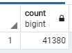
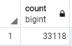
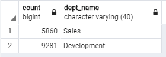

# Pewlett-Hackard-Analysis

## Overview
Modernize Pewlett Hackard HR data management by migrating their spreadsheets to a database and prepare the data for better analysis. Will be genrating ERD diagrams to show the map of the database, then create tables from the csv files, and create the relationships between the tables using primary and foreign keys to create a data model for analysis. We will find all the retiring employees in the company.

## Resources
 - Data Source: departments.csv, employees.csv, titles.csv, salaries.csv, dept_emp.csv, dept_manager.csv
 - Software: QuickDBD, PostgresSQL 11, pgAdmin 4.24

## Results
ERD diagram:

Criteria used for finding employees that are retiring are as follows.
 - Employees born between '1952-01-01' and '1955-12-31'
   -- That makes them to be in the ages between 65 to 68 years old in 2020. 
 - Employees hired between '1985-01-01' and '1988-12-31'
   -- That makes them to be with the company for 32 to 35 years in 2020.

Based on the above criteria we see that we have 41,380 employees getting ready to retire. However that doesnt take into account employees that are not currently employeed. So adding a further constraint to restrict employees currently employeed and retiring, we see that the count is at 33,118.

Also department head for Sales wanted a list of employees in both sales and development departments, so they can propose a mentorship program to their CEO to get experienced and successful employees stepping back into a part-time role instead of retiring completely

 

## Summary
Based on the findings above we have 33,118 employees retiring in 2020 that were hired between 1985 and 1988. However this doesn't take into account all the employees that were hired before and after and would reach retiring age in 2020.

## Challenge Overview

## Challenge Results

## Challenge Summary

