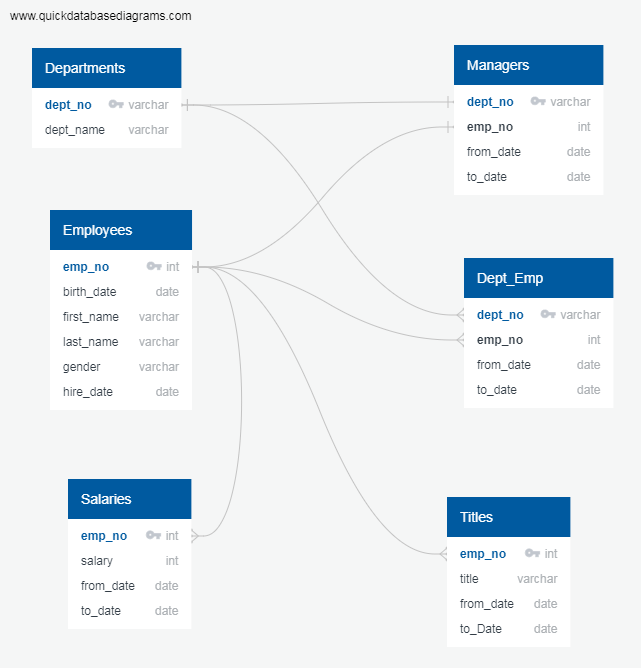
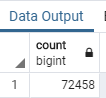

# Pewlett-Hackard-Analysis

## Overview
Modernize Pewlett Hackard HR data management by migrating their spreadsheets to a database and prepare the data for better analysis. Will be genrating ERD diagrams to show the map of the database, then create tables from the csv files, and create the relationships between the tables using primary and foreign keys to create a data model for analysis. We will find all the retiring employees in the company.

## Resources
 - Data Source: departments.csv, employees.csv, titles.csv, salaries.csv, dept_emp.csv, dept_manager.csv
 - Software: QuickDBD, PostgresSQL 11, pgAdmin 4.24

## Results
ERD diagram:

Criteria used for finding employees that are retiring are as follows.
 - Employees born between '1952-01-01' and '1955-12-31'
   -- That makes them to be in the ages between 65 to 68 years old in 2020. 
 - Employees hired between '1985-01-01' and '1988-12-31'
   -- That makes them to be with the company for 32 to 35 years in 2020.

Based on the above criteria we see that we have 41,380 employees getting ready to retire. However that doesnt take into account employees that are not currently employeed. So adding a further constraint to restrict employees currently employeed and retiring, we see that the count is at 33,118.

Also department head for Sales wanted a list of employees in both sales and development departments, so they can propose a mentorship program to their CEO to get experienced and successful employees stepping back into a part-time role instead of retiring completely

 

## Summary
Based on the findings above we have 33,118 employees retiring in 2020 that were hired between 1985 and 1988. However this doesn't take into account all the employees that were hired before and after and would reach retiring age in 2020.

## Challenge Overview
Based on the project further information was requested by the manager, to prepare for the upcoming "silver tsunami". 

Criteria shown below:
 - The Number of Retiring Employees by Title
   -- Criteria is employees born between '1952-01-01' and '1955-12-31'
 - The Employees Eligible for the Mentorship Program
   -- Criteria is employees born between '1965-01-01' and '1965-12-31'

## Challenge Results

- Looking at the results there are quite a large number of employees retring 90k+.
- However number of employees currently employeed and retiring are only 33k+ from the project criteria, this doesn't match the findings.
- There are very few employees that qualify to be mentors (1549).
- Rather than using the 1965 as the birth year for mentor program criteria, we should have birth years between 1956 and 1965.

### Retiring Employees by Title

#### Total number of employees retirng with unique titles are 90398

#### Total number of employees retirng by titles shown below

### Eligible Employees for Mentor Program

#### Total count of the employees eligible for mentor program

#### Total count of the employees eligible for mentor program by department

## Challenge Summary
Answering following questions we find that we need to modify our queries further.
 - How many roles will need to be filled as the "silver tsunami" begins to make an impact?
  -- 90398
 - Are there enough qualified, retirement-ready employees in the departments to mentor the next generation of Pewlett Hackard employees?
  -- No there are not enough employees. There are only 1549 employees qualified to mentor new employees, which is very very low.
  
Based on the challenge results adding the following criteria will get us the actual results of retiring employees.
 - Employees born between 1952-01-01 and 1955-12-31
 - Employees currently employed (to_date = '9999-01-01')
 - The total number of current employees getting ready to retire adding the new criteria are 72,458 
 
  
 
For mentor program changing the criteria gives us better information
 - Employees born between 1956-01-01 and 1965-12-31
 - Hired between 1985-01-01 and 1985-12-31
 - The total number of employees that qualify to be mentors with the new criteria are 19,736
 
 We have 19K+ mentors, though that is a smaller number but each can mentor about 5 new employees before they retire, as opposed to 1549 having to mentor like about 50.
 
  
 
 This shows some departments the mentor to mentee ratio could be as low as 1 to 1, to as high as 1 to 10.
  
  
